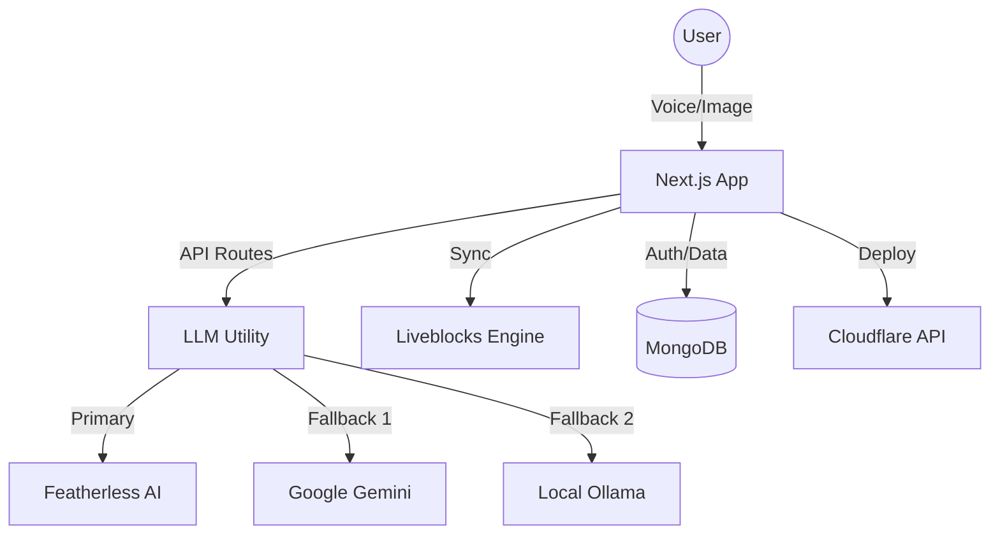

# WebCraft AI 🚀

[](LICENSE)
[](https://nextjs.org/)
[](https://liveblocks.io/)
[](https://tailwindcss.com/)

> **The AI-Powered Canvas for Instant Web Development**  
> Transform ideas into production-ready UI through voice, screenshots, and real-time collaboration.

---

WebCraft AI is a revolutionary web design platform that bridges the gap between imagination and implementation. Built for hackathons and production workflows alike, it leverages state-of-the-art vision LLMs and voice recognition to make web development as simple as talking or taking a picture.

## ✨ Key Features

- 🎙️ **Voice-Driven UI Generation**: Speak your design into existence. Uses the Web Speech API to parse natural language commands into structured UI components.
- 📸 **Screenshot-to-Clone**: Upload a screenshot of any website, and our Vision LLM (Llama 3.2 / Gemini) will instantly recreate it as editable components.
- 👥 **Real-Time Collaboration**: Powered by Liveblocks. Design with your team in a shared multiplayer workspace with presence and live updates.
- ☁️ **Instant Deployment**: Deploy your crafted sites to custom Cloudflare subdomains with a single click.
- 🎨 **Component Library**: A rich set of pre-designed, responsive components ready for customization.

## 🛠️ Tech Stack

| Category | Technology |
| :--- | :--- |
| **Frontend** | [Next.js 14](https://nextjs.org/) (App Router), [React](https://reactjs.org/) |
| **Styling** | [Tailwind CSS](https://tailwindcss.com/), [GSAP](https://greensock.com/gsap/) |
| AI / LLM | [Featherless AI](https://featherless.ai/), [Google Gemini](https://ai.google.dev/), [Ollama](https://ollama.com/) |
| **Collaboration** | [Liveblocks](https://liveblocks.io/) |
| **Database** | [MongoDB](https://www.mongodb.com/) (Mongoose) |
| **Deployment** | [Cloudflare Pages](https://pages.cloudflare.com/) & [Vercel](https://vercel.com/) |

## 🚀 Local Setup

Follow these steps to get WebCraft AI running on your local machine:

### 1. Clone the Repository
```bash
git clone https://github.com/Rakshi2609/web-craft.git
cd web-craft
```

### 2. Install Dependencies
```bash
npm install
```

### 3. Configure Environment Variables
Create a `.env` file in the root directory and add the following:

```env
# AI Providers
FEATHERLESS_API_KEY=your_featherless_key
GEMINI_API_KEY=your_google_gemini_key # Required for fallback

# Collaboration
LIVEBLOCKS_SECRET_KEY=your_liveblocks_key

# Database
MONGODB_URI=your_mongodb_connection_string

# Deployment (Cloudflare)
CLOUDFLARE_API_TOKEN=your_cf_token
CLOUDFLARE_ZONE_ID=your_cf_zone_id
NEXT_PUBLIC_ROOT_DOMAIN=yourdomain.com
```

### 4. Run the Development Server
```bash
npm run dev
```
Open [http://localhost:3000](http://localhost:3000) in your browser.

## 🏗️ Architecture



## 🖼️ Screenshots

*(Add your high-quality screenshots here to showcase the UI)*

| Dashboard | Vision Mode |
| :---: | :---: |
|  |  |

## 🤝 Contributing

Contributions are what make the open-source community such an amazing place to learn, inspire, and create. Any contributions you make are **greatly appreciated**.

1. Fork the Project
2. Create your Feature Branch (`git checkout -b feature/AmazingFeature`)
3. Commit your Changes (`git commit -m 'Add some AmazingFeature'`)
4. Push to the Branch (`git push origin feature/AmazingFeature`)
5. Open a Pull Request

## 📄 License

Distributed under the MIT License. See `LICENSE` for more information.

---
Built with ❤️ by the WebCraft AI Team.
